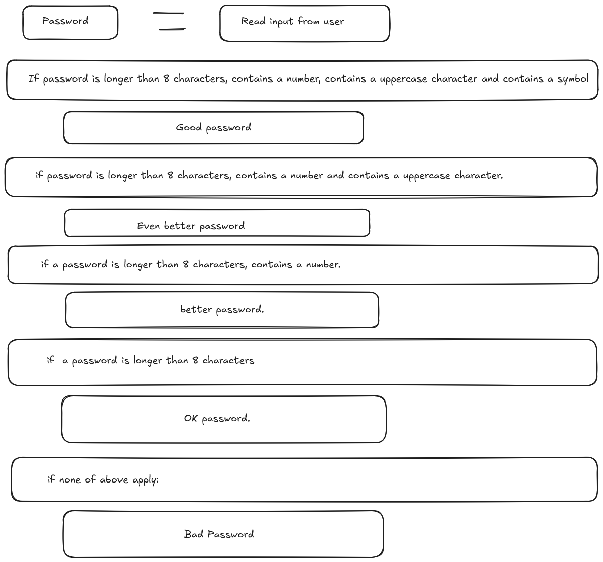

# Password Checker Program

### A simple password checker that checks if a password is strong or not.

Tested with:  
pass  - BAD password - <u>must</u> be more than 8 characters  
password  - BAD password - <u>must</u> be more than 8 characters  
passwords  - OK password - more than 8 characters  
Passwords  - Better password - more than 8 character and includes an upper case character  
Passwords1  - Even better password - more than 8 character and includes and upper case character and digit  
Passwords1!  - Good Password - Passes all checks. Upper case. digit. symbol.  
